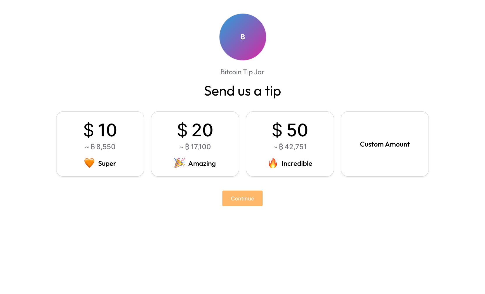

# Building a Bitcoin Lightning Tip Jar

This tutorial walks through building a Bitcoin Lightning Network tip jar.

## Building Blocks

- Node.js 18+ and pnpm
- Vite + Typescript + React
- Bitcoin Builder Kit
- TailwindCSS
- Netlify (free tier)
- Voltage Payments API account (free for mutinynet)
- Kraken API access (free)

## Step 1: Create new Vite Project

```bash
npm create vite@latest btc-tip-jar -- --template react-ts && pnpm i
```

### Check your step 1 work

Run `pnpm dev`. You should find a web page at http://localhost:5173 that says "Vite + React" in the heading. If so, step 1 is complete.

## Step 2: Scaffold UI for landing page

Install TailwindCSS and Bitcoin Builder Kit.

```bash
pnpm add tailwindcss @tailwindcss/vite @sbddesign/bui-ui @sbddesign/bui-tokens @sbddesign/bui-icons
```

Add the TailwindCSS plugin to `vite.config.ts`.

```typescript
import { defineConfig } from 'vite'
import react from '@vitejs/plugin-react'
import tailwindcss from '@tailwindcss/vite'

// https://vite.dev/config/
export default defineConfig({
  plugins: [
    react(),
    tailwindcss()
  ],
})
```

Update `index.css` to import Tailwind, use variables from the Bitcoin Builder Kit instead of harcoded colors, and other style enhancements.

Note: very important to import Tailwind, or else much of the tailwind styling will not take effect.

```css
@import "tailwindcss";

:root {
  font-family: 'Outfit', -apple-system, BlinkMacSystemFont, 'Segoe UI', 'Roboto', 'Oxygen',
    'Ubuntu', 'Cantarell', 'Fira Sans', 'Droid Sans', 'Helvetica Neue',
    sans-serif;
  line-height: 1.5;
  font-weight: 400;

  color-scheme: light dark;
  color: var(--text-primary);
  background: var(--background);

  font-synthesis: none;
  text-rendering: optimizeLegibility;
  -webkit-font-smoothing: antialiased;
  -moz-osx-font-smoothing: grayscale;
  -webkit-text-size-adjust: 100%;
  width: 100%;
}

#root {
  width: 100%;
  color: var(--text-primary);
}

* {
  box-sizing: border-box;
}

body, html {
  width: 100%;
  background: var(--background);
}

body {
  margin: 0;
  display: flex;
  place-items: center;
  font-family: 'Outfit', sans-serif;
}
```

Update `index.html` to include the Outfit font from Google fonts, the title "Bitcoin Tip Jar", and a `data-mode` (bitcoindesign, conduit) and `data-theme` (light, dark) on the `<body>` tag.

Note: the `data-mode` and `data-theme` is critical, or much of the Bitcoin Builder Kit styling will not work.

```html
<!doctype html>
<html lang="en">
  <head>
    <meta charset="UTF-8" />
    <link rel="icon" type="image/svg+xml" href="/vite.svg" />
    <meta name="viewport" content="width=device-width, initial-scale=1.0" />
    <meta name="viewport" content="width=device-width, initial-scale=1.0" />
    <link rel="preconnect" href="https://fonts.googleapis.com">
    <link rel="preconnect" href="https://fonts.gstatic.com" crossorigin>
    <link href="https://fonts.googleapis.com/css2?family=Outfit:wght@100..900&display=swap" rel="stylesheet">
    <title>Bitcoin Tip Jar</title>
  </head>
  <body data-theme="bitcoindesign" data-mode="light">
    <div id="root"></div>
    <script type="module" src="/src/main.tsx"></script>
  </body>
</html>
```

Create `src/components/Recipient.tsx` with the following:

```typescript
import { BuiAvatarReact as BuiAvatar } from '@sbddesign/bui-ui/react';

interface RecipientProps {
  size?: 'Large' | 'Small';
}

function Recipient({ size = "Large" }: RecipientProps) {
  // Get the name from environment variable
  const name = import.meta.env.VITE_TIP_JAR_NAME || "Bitcoin Tip Jar";
  const nameElement = (
    <div className="relative shrink-0 text-[#71717b] text-2xl text-center">
      <p className="whitespace-nowrap">{name}</p>
    </div>
  );

  if (size === "Small") {
    return (
      <div className="flex flex-col gap-4 items-center justify-start relative w-full" data-name="Size=Small">
        <div className="w-16 h-16" data-name="Avatar" data-node-id="6903:5809">
          <BuiAvatar 
            size={'large'}
            showInitial='true'
            text="₿itcoin Tip Jar"
          />
        </div>
        {nameElement}
      </div>
    );
  }

  return (
    <div className="flex flex-col gap-6 items-center justify-start relative w-full" data-name="Size=Large">
      <div className="w-40 h-40" data-name="Avatar" data-node-id="6903:5799">
        <BuiAvatar 
          size={'large'}
          showInitial='true'
          text="₿itcoin Tip Jar"
        />
      </div>
      {nameElement}
    </div>
  );
}

export default function RecipientComponent() {
  return (
    <div data-name="Recipient">
      <Recipient />
    </div>
  );
}

export { Recipient };
```

Replace the contents of `App.tsx` with the following:

```import { useState } from 'react'
import { 
  BuiAmountOptionTileReact as BuiAmountOptionTile,
  BuiButtonReact as BuiButton
} from '@sbddesign/bui-ui/react'
import '@sbddesign/bui-ui/tokens.css'
import { Recipient } from './components/Recipient'

// Type definition for tip options
interface TipOption {
  id: number;
  primaryAmount: number;
  secondaryAmount: number;
  emoji: string;
  message: string;
  selected: boolean;
}

// Base tip amounts (USD) - secondary amounts (sats) will be calculated dynamically
const baseTipOptions = [
  {
    id: 1,
    primaryAmount: 10,
    secondaryAmount: 10000,
    emoji: '🧡',
    message: 'Super',
    selected: false
  },
  {
    id: 2,
    primaryAmount: 20,
    secondaryAmount: 20000,
    emoji: '🎉',
    message: 'Amazing',
    selected: false
  },
  {
    id: 3,
    primaryAmount: 50,
    secondaryAmount: 50000,
    emoji: '🔥',
    message: 'Incredible',
    selected: false
  }
]

function App() {
  const [selectedAmount, setSelectedAmount] = useState<number | null>(null)
  const [tipOptionsState, setTipOptionsState] = useState<TipOption[]>(baseTipOptions)

  const handleAmountSelect = (amount: number) => {
    setSelectedAmount(amount)
    setTipOptionsState(prev => 
      prev.map(option => ({
        ...option,
        selected: option.primaryAmount === amount
      }))
    )
  }

  return (
    <div className="text-center flex flex-col gap-8 lg:gap-12 p-6 lg:p-12">
      <header className="flex flex-col gap-4 lg:gap-6">
        <Recipient size="Large" />
        <p className="text-3xl lg:text-5xl">{import.meta.env.VITE_TIP_JAR_SLOGAN || "Send us a tip"}</p>
      </header>

      {/* Tip options */}
        <div className="flex flex-col lg:flex-row w-full gap-6 max-w-xl lg:max-w-7xl mx-auto">
          {tipOptionsState.map((option) => (
            <BuiAmountOptionTile
              emoji={option.emoji}
              message={option.message}
              showEmoji={true}
              showMessage={true}
              showSecondaryCurrency={true}
              custom={false}
              selected={option.selected}
              primaryAmount={option.primaryAmount}
              primarySymbol={'$'}
              secondaryAmount={option.secondaryAmount}
              secondarySymbol={'₿'}
              showEstimate={true}
              primaryTextSize="6xl"
              secondaryTextSize="2xl"
              onClick={() => handleAmountSelect(option.primaryAmount)}
              key={option.id}
            />
          ))}
          <BuiAmountOptionTile
            custom={true}
            amountDefined={false}
            primaryAmount={0}
            secondaryAmount={0}
            showSecondaryCurrency={true}
            secondarySymbol={'₿'}
            showEstimate={true}
            primaryTextSize="6xl"
            secondaryTextSize="2xl"
            selected={selectedAmount !== null && !tipOptionsState.some(opt => opt.selected)}
          />
        </div>

        <div className="text-center">
          <BuiButton
            styleType="filled"
            size="large"
            label="Continue"
            disabled={!selectedAmount ? "true" : ""}
          />
        </div>
    </div>
  )
}

export default App
```

### Check your step 2 work

In [your browser](http://localhost:5173/), you should see a white screen with 3 tip options ($10, $20, $50, Custom Amount). The top header has an avatar with "Bitcoin Tip Jar" and "Send us a tip".


## Step 3: Get price of bitcoin with Kraken

Create `src/services/priceApi.ts` with this content:

```typescript
// Kraken API service for fetching Bitcoin prices

export interface KrakenTickerResponse {
  error: string[];
  result: {
    XXBTZUSD: {
      a: [string, string, string]; // ask [price, whole lot volume, lot volume]
      b: [string, string, string]; // bid [price, whole lot volume, lot volume]
      c: [string, string]; // last trade closed [price, lot volume]
      v: [string, string]; // volume [today, last 24 hours]
      p: [string, string]; // volume weighted average price [today, last 24 hours]
      t: [number, number]; // number of trades [today, last 24 hours]
      l: [string, string]; // low [today, last 24 hours]
      h: [string, string]; // high [today, last 24 hours]
      o: string; // today's opening price
    };
  };
}

export class PriceApiError extends Error {
  public status?: number;
  public response?: any;

  constructor(
    message: string,
    status?: number,
    response?: any
  ) {
    super(message);
    this.name = 'PriceApiError';
    this.status = status;
    this.response = response;
  }
}

class PriceApi {
  private baseUrl = 'https://api.kraken.com/0/public';

  async getBtcUsdPrice(): Promise<number> {
    try {
      console.log('Fetching BTC/USD price from Kraken...');
      
      const response = await fetch(`${this.baseUrl}/Ticker?pair=XBTUSD`);
      
      if (!response.ok) {
        throw new PriceApiError(
          `HTTP ${response.status}: ${response.statusText}`,
          response.status
        );
      }

      const data: KrakenTickerResponse = await response.json();
      
      if (data.error && data.error.length > 0) {
        throw new PriceApiError(`Kraken API Error: ${data.error.join(', ')}`);
      }

      if (!data.result?.XXBTZUSD) {
        throw new PriceApiError('Invalid response format from Kraken API');
      }

      // Use the last trade price (most recent actual trade)
      const lastPrice = parseFloat(data.result.XXBTZUSD.c[0]);
      
      console.log(`Current BTC/USD price: $${lastPrice.toLocaleString()}`);
      
      return lastPrice;
    } catch (error) {
      console.error('Failed to fetch BTC price:', error);
      
      if (error instanceof PriceApiError) {
        throw error;
      }
      
      throw new PriceApiError(
        `Failed to fetch Bitcoin price: ${error instanceof Error ? error.message : 'Unknown error'}`
      );
    }
  }

  // Convert USD amount to satoshis using current BTC price
  async convertUsdToSats(usdAmount: number): Promise<number> {
    const btcPrice = await this.getBtcUsdPrice();
    const btcAmount = usdAmount / btcPrice;
    const satoshis = Math.round(btcAmount * 100_000_000); // 1 BTC = 100,000,000 sats
    
    console.log(`$${usdAmount} USD = ${btcAmount.toFixed(8)} BTC = ${satoshis.toLocaleString()} sats`);
    
    return satoshis;
  }
}

export const priceApi = new PriceApi();

// Helper function to get current BTC/USD price with caching
let priceCache: { price: number; timestamp: number } | null = null;
const CACHE_DURATION = 60 * 1000; // 1 minute cache

export async function getCurrentBtcPrice(): Promise<number> {
  const now = Date.now();
  
  // Return cached price if it's still fresh
  if (priceCache && (now - priceCache.timestamp) < CACHE_DURATION) {
    console.log(`Using cached BTC price: $${priceCache.price.toLocaleString()}`);
    return priceCache.price;
  }
  
  try {
    const price = await priceApi.getBtcUsdPrice();
    priceCache = { price, timestamp: now };
    return price;
  } catch (error) {
    // If we have a cached price and the API fails, use the cached price
    if (priceCache) {
      console.warn('Price API failed, using cached price:', error);
      return priceCache.price;
    }
    
    // If no cache and API fails, throw the error
    throw error;
  }
}

// Helper function to convert USD to sats with caching
export async function convertUsdToSats(usdAmount: number): Promise<number> {
  const btcPrice = await getCurrentBtcPrice();
  const btcAmount = usdAmount / btcPrice;
  const satoshis = Math.round(btcAmount * 100_000_000);
  
  return satoshis;
}
```

Add these new imports to `App.tsx`:

```typescript
import { useEffect } from 'react'
import { getCurrentBtcPrice, PriceApiError } from './services/priceApi'
```

Add the following to `App.tsx` inside of the main `App` function:

```typescript
  const [isLoadingPrices, setIsLoadingPrices] = useState(true)
  const [priceError, setPriceError] = useState<string | null>(null)

  // Load Bitcoin price and calculate secondary amounts on component mount
  useEffect(() => {
    const loadPricesAndCalculateAmounts = async () => {
      try {
        setIsLoadingPrices(true)
        setPriceError(null)
        
        console.log('Loading Bitcoin price...')
        const btcPrice = await getCurrentBtcPrice()
        
        // Calculate secondary amounts (satoshis) for each tip option
        const tipOptionsWithSats: TipOption[] = baseTipOptions.map(option => {
          const btcAmount = option.primaryAmount / btcPrice
          const satoshis = Math.round(btcAmount * 100_000_000) // Convert to sats
          
          return {
            ...option,
            secondaryAmount: satoshis
          }
        })
        
        console.log('Tip options with calculated sats:', tipOptionsWithSats)
        setTipOptionsState(tipOptionsWithSats)
        
      } catch (error) {
        console.error('Failed to load Bitcoin price:', error)
        
        if (error instanceof PriceApiError) {
          setPriceError(`Failed to load Bitcoin price: ${error.message}`)
        } else {
          setPriceError('Failed to load Bitcoin price. Please try again.')
        }
        
        // Use fallback prices if API fails
        const fallbackOptions: TipOption[] = baseTipOptions.map(option => ({
          ...option,
          secondaryAmount: Math.round(option.primaryAmount * 1500) // Rough fallback: $1 ≈ 1500 sats
        }))
        
        setTipOptionsState(fallbackOptions)
        
      } finally {
        setIsLoadingPrices(false)
      }
    }

    loadPricesAndCalculateAmounts()
  }, [])
```

To reflect the fetching of the price information and handle errors in the `App.tsx` UI, add these underneath the `<header>`:

```typescript
{/* Loading state */}
{isLoadingPrices && (
<div className="flex flex-col items-center gap-4 py-8">
    <div className="animate-spin rounded-full h-8 w-8 border-b-2 border-[var(--text-primary)]"></div>
    <p className="text-[var(--text-secondary)]">Loading Bitcoin prices...</p>
</div>
)}

{/* Price error state */}
{priceError && (
<div className="flex flex-col items-center gap-4 py-4">
    <p className="text-red-500 text-sm">⚠️ {priceError}</p>
    <p className="text-[var(--text-secondary)] text-xs">Using approximate prices</p>
</div>
)}
```

And finally, to show the prices in the UI, individually wrap the "Tip options" `<div>` and the "Continue" `<BuiButton>` in a check for the loading prices const:

```typescript
{!isLoadingPrices && (
    <div className="...">
        {tipOptionsState.map((option) => (
        // BuiAmountOptionTile
        )}
    </div>
)}

{!isLoadingPrices && (
    <div className="text-center">
        <BuiButton
            styleType="filled"
            size="large"
            label="Continue"
            disabled={!selectedAmount ? "true" : ""}
        />
    </div>
)}
```

### Check your step 3 work

In [your browser](http://localhost:5173/), you should see a white screen with the 3 tip options and custom amount, as before. However, now there should be an accurate bitcoin price underneath each USD amount.

